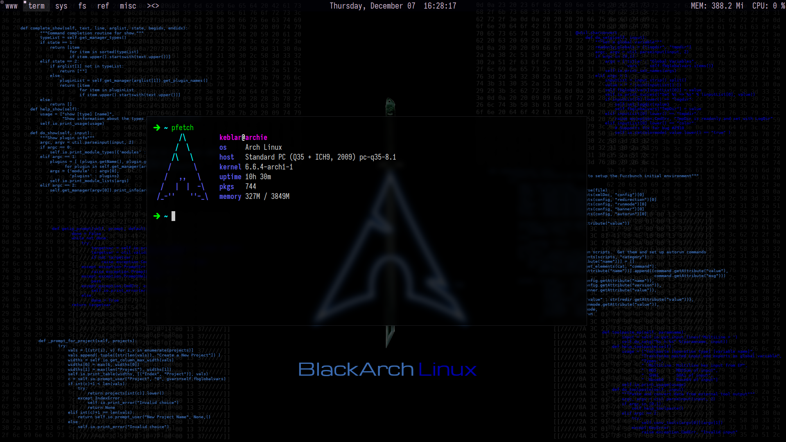
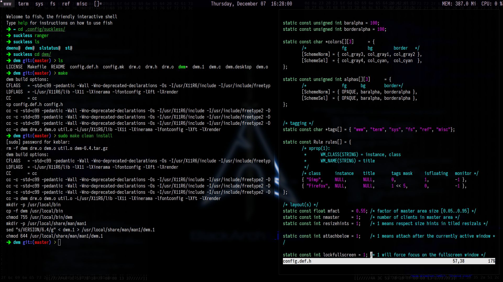

A simple dwm implementation among other programs of [the suckless project](https://suckless.org) for my hacking practices

## Requirements
### Suckless Software
- [dwm](https://dwm.suckless.org/), a minimal dynamic window manager
- [dmenu](https://tools.suckless.org/dmenu/), dynamic menu for X
- [st](https://st.suckless.org/), simple terminal implementation for X
- [slstatus](https://tools.suckless.org/slstatus/), simple status monitor for wm that us WM_NAME or stdin to fill the status bar

### Additional dependencies
- None (at least that's the idea)
- [Iosevka SS09 Font](https://github.com/be5invis/Iosevka)
- [feh](https://github.com/derf/feh)
- [Polkit](https://wiki.archlinux.org/title/Polkit), you can choose the one you want, in my case (and in the [autostart.sh](./.dwm/autostart.sh)) it's defined to use [polkit-gnome](https://archlinux.org/packages/?name=polkit-gnome)
- [picom](https://github.com/yshui/picom)
- [brightnessctl](https://github.com/Hummer12007/brightnessctl)

## Screenshots

## Others

### Information
Here are some details about my setup
- OS: [Arch Linux](https://archlinux.org/), with [BlackArch Repositories](https://blackarch.org/downloads.html) enabled
- Shell: [Fish](https://fishshell.com/)
- Editor: [Neovim](https://github.com/neovim/neovim)

### To Do
- [ ] Installation script
- [ ] References to dwm patches
- [ ] Add more features to slstatus
- [ ] Add a display locker
- [ ] More information about keyboad shortcuts